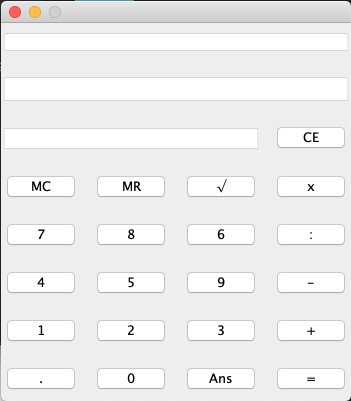

# Calculator

### IF2210 - Tugas Besar 1
Kelompok 06
1.	13518028 / Ilham Syahid Syamsudin
2.	13518046 / Ferdina Wiranti Afifah
3.	13518055 / William Fu
4.	13518097 / Rakha Fadhilah


## Struktur Kode
Aplikasi ini memanfaatkan tiga buah package, yaitu:
- memcalc : package untuk implementasi fitur MC dan MR
- expression : package untuk implementasi ekspresi matematika pada kalkulator
- ui : package untuk mengimplementasikan GUI aplikasi

Aplikasi ini terbagi atas tiga buah folder :
- .idea : folder untuk konfigurasi program pada IDE
- src : folder yang berisi source code dari package dan main program
- bin : folder berisi program berupa file Calculator.jar
- tests : folder yang berisi unit testing setiap package


## Compiling and Running
Gunakan aplikasi IDE (contoh: IntelliJ) untuk membuka file project ini dan jalankan main program dengan command `RUN` atau jalankan pada terminal
```find . -name "*.java" > sources.txt && javac @sources.txt -encoding ISO-8859-1 && cd src/ && java Main```

Anda juga dapat menjalankan file Calculator.jar dengan menggunakan command ```java -jar Calculator.jar``` pada folder bin

## Screenshot Aplikasi

